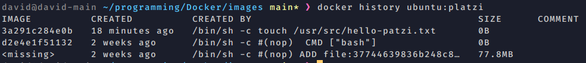

# Docker course

- [Docker course](#docker-course)
  - [Installation](#installation)
    - [Post-Installation](#post-installation)
  - [Uninstall docker](#uninstall-docker)
- [Dónde se guardan los archivos de docker?](#dónde-se-guardan-los-archivos-de-docker)
- [Problemas de desarrollo de software](#problemas-de-desarrollo-de-software)
- [Virtualización](#virtualización)
- [Que es docker](#que-es-docker)
- [Contenedores](#contenedores)
  - [Corriendo nuestro primer contenedor](#corriendo-nuestro-primer-contenedor)
  - [Modo interactivo -it](#modo-interactivo--it)
  - [Ciclo de vida de un contenedor](#ciclo-de-vida-de-un-contenedor)
  - [Exponiendo contenedores](#exponiendo-contenedores)
  - [Bind mounts](#bind-mounts)
  - [Volume](#volume)
  - [Insertar y extraer archivos de un contenedor](#insertar-y-extraer-archivos-de-un-contenedor)
  - [tmpfs mount - temporary file system mount](#tmpfs-mount---temporary-file-system-mount)
- [Imágenes](#imágenes)
  - [Creación de nuestras propias imágenes](#creación-de-nuestras-propias-imágenes)
    - [Creación del Dockerfile](#creación-del-dockerfile)
  - [El sistema de capas](#el-sistema-de-capas)
  - [Creating our custom image from nginx](#creating-our-custom-image-from-nginx)
  - [How to deploy our custom image](#how-to-deploy-our-custom-image)
    - [registery](#registery)
    - [SAVE AND LOAD IMAGES AS FILES](#save-and-load-images-as-files)
- [Usando docker para desarrollar aplicaciones](#usando-docker-para-desarrollar-aplicaciones)
- [Comandos docker](#comandos-docker)
  - [* `docker build -t [name:tag] -f path_to_dockerfile` -> construye una imagen especificando el path dnd stá el dockerfile](#-docker-build--t-nametag--f-path_to_dockerfile---construye-una-imagen-especificando-el-path-dnd-stá-el-dockerfile)
  - [* `docker container exec -it containerName bash` -> ejecuta el comando en un container ya running](#-docker-container-exec--it-containername-bash---ejecuta-el-comando-en-un-container-ya-running)
  - [* `docker exec -it alwaysup bash` -> exec nos permite correr un proceso dentro del contenedor](#-docker-exec--it-alwaysup-bash---exec-nos-permite-correr-un-proceso-dentro-del-contenedor)
  - [* `docker inspect imageName` -> nos da la configuración de esa imagen](#-docker-inspect-imagename---nos-da-la-configuración-de-esa-imagen)
  - [* `docker login` -> log into docker hub](#-docker-login---log-into-docker-hub)
  - [* `docker pull` -> download an image form your registry (usually DockerHub)](#-docker-pull---download-an-image-form-your-registry-usually-dockerhub)
  - [* `docker rmi imageName` -> borra la imagen especificada](#-docker-rmi-imagename---borra-la-imagen-especificada)
  - [* `docker system prune -a ` -> borra todas las imágenes que no tengan un contenedor corriendo](#-docker-system-prune--a----borra-todas-las-imágenes-que-no-tengan-un-contenedor-corriendo)
  - [* `docker volumes prune` -> para eliminar tb volumenes unused](#-docker-volumes-prune---para-eliminar-tb-volumenes-unused)

## Installation

source : https://docs.docker.com/engine/install/ubuntu/

1. Set up the repository

first of all uninstall old versions


Uninstall the Docker Engine, CLI, and Containerd packages:

```
sudo apt remove docker docker-engine docker.io containerd runc
 sudo apt-get purge docker-ce docker-ce-cli containerd.io
```

 
Images, containers, volumes, or customized configuration files on your host are not automatically removed. To delete all images, containers, and volumes:
```
 sudo rm -rf /var/lib/docker
 sudo rm -rf /var/lib/containerd

```
You must delete any edited configuration files manually.

Most users set up Docker’s repositories and install from them, for ease of installation and upgrade tasks. This is the recommended approach.

Update the apt package index and install packages to allow apt to use a repository over HTTPS:

```
 sudo apt-get update
 sudo apt-get install \
    ca-certificates \
    curl \
    gnupg \
    lsb-release
```

Add Docker’s official GPG key:

```
curl -fsSL https://download.docker.com/linux/ubuntu/gpg | sudo gpg --dearmor -o /usr/share/keyrings/docker-archive-keyring.gpg
```

Use the following command to set up the stable repository. To add the nightly or test repository, add the word nightly or test (or both) after the word stable in the commands below. Learn about nightly and test channels.

```
echo \
  "deb [arch=$(dpkg --print-architecture) signed-by=/usr/share/keyrings/docker-archive-keyring.gpg] https://download.docker.com/linux/ubuntu \
  $(lsb_release -cs) stable" | sudo tee /etc/apt/sources.list.d/docker.list > /dev/null
```
1. Install Docker Engine

Update the apt package index, and install the latest version of Docker Engine and containerd, or go to the next step to install a specific version:

```
 sudo apt-get update
 sudo apt-get install docker-ce docker-ce-cli containerd.io
```

Got multiple Docker repositories?

If you have multiple Docker repositories enabled, installing or updating without specifying a version in the apt-get install or apt-get update command always installs the highest possible version, which may not be appropriate for your stability needs.

To install a specific version of Docker Engine, list the available versions in the repo, then select and install:

a. List the versions available in your repo:

```
apt-cache madison docker-ce
```
b. Install a specific version using the version string from the second column, for example, 5:18.09.1~3-0~ubuntu-xenial.

```
sudo apt-get install docker-ce=<VERSION_STRING> docker-ce-cli=<VERSION_STRING> containerd.io
```

3. Verify that Docker Engine is installed correctly by running the hello-world image.

```
 sudo docker run hello-world
```

This command downloads a test image and runs it in a container. When the container runs, it prints a message and exits.

Docker Engine is installed and running. The docker group is created but no users are added to it. You need to use sudo to run Docker commands. Continue to Linux postinstall to allow non-privileged users to run Docker commands and for other optional configuration steps.
https://docs.docker.com/engine/install/linux-postinstall/

### Post-Installation

1. Manage Docker as a non-root user🔗

The Docker daemon binds to a Unix socket instead of a TCP port. By default that Unix socket is owned by the user root and other users can only access it using sudo. The Docker daemon always runs as the root user.

If you don’t want to preface the docker command with sudo, meanwhile docker installations a docker group is created so we just have to add users to it. When the Docker daemon starts, it creates a Unix socket accessible by members of the docker group.

Warning

The docker group grants privileges equivalent to the root user. For details on how this impacts security in your system, see Docker Daemon Attack Surface.

Note:

To run Docker without root privileges, see Run the Docker daemon as a non-root user (Rootless mode).


Add your user to the docker group.

```
sudo usermod -aG docker $USER
```

Log out and log back in so that your group membership is re-evaluated.

If testing on a virtual machine, it may be necessary to restart the virtual machine for changes to take effect.

On a desktop Linux environment such as X Windows, log out of your session completely and then log back in.

On Linux, you can also run the following command to activate the changes to groups:

```
newgrp docker
```

Verify that you can run docker commands without sudo.
```
 docker run hello-world
```

This command downloads a test image and runs it in a container. When the container runs, it prints a message and exits.

If you initially ran Docker CLI commands using sudo before adding your user to the docker group, you may see the following error, which indicates that your ~/.docker/ directory was created with incorrect permissions due to the sudo commands.

WARNING: Error loading config file: /home/user/.docker/config.json -
stat /home/user/.docker/config.json: permission denied
To fix this problem, either remove the ~/.docker/ directory (it is recreated automatically, but any custom settings are lost), or change its ownership and permissions using the following commands:

```
sudo chown "$USER":"$USER" /home/"$USER"/.docker -R
sudo chmod g+rwx "$HOME/.docker" -R
```

2. Configure Docker to start on boot

Most current Linux distributions (RHEL, CentOS, Fedora, Debian, Ubuntu 16.04 and higher) use systemd to manage which services start when the system boots. On Debian and Ubuntu, the Docker service is configured to start on boot by default. To automatically start Docker and Containerd on boot for other distros, use the commands below:

```
sudo systemctl enable docker.service
sudo systemctl enable containerd.service
```

To disable this behavior, use disable instead.
```
sudo systemctl disable docker.service
sudo systemctl disable containerd.service
```
## Uninstall docker 

1. Uninstall the Docker Engine, CLI, and Containerd packages:

```
 sudo apt-get purge docker-ce docker-ce-cli containerd.io
```
2. Images, containers, volumes, or customized configuration files on your host are not automatically removed. To delete all images, containers, and volumes:

```
 sudo rm -rf /var/lib/docker
 sudo rm -rf /var/lib/containerd

```
You must delete any edited configuration files manually.

# Dónde se guardan los archivos de docker?

Los datos de docker se guardan en el docker root folder:

* Ubuntu: /var/lib/docker/
* Fedora: /var/lib/docker/
* Debian: /var/lib/docker/
* Windows: C:\ProgramData\DockerDesktop
* MacOS: ~/Library/Containers/com.docker.docker/Data/vms/0/

Aquí podremos encontrar las imágenes, los containers, nerworks,builds, clusters,etc

Los contenidos más pesados ​​suelen ser imágenes. Si usa el controlador de almacenamiento predeterminado `overlay2`, sus imágenes de Docker se almacenan en /var/lib/docker/overlay2. Allí, puede encontrar diferentes archivos que representan capas de solo lectura de una imagen de Docker y una capa superior que contiene sus cambios.


# Problemas de desarrollo de software

1. construir el software
2. distribuirlo
3. ejecutar

1. contruir software 

Escribir el código es solo una pequeña parte. Los problemas surgen cuando trabajamos en equipo:

- tenemos que trabajar todos en el mismo entorno de desarrollo
- usar las mismas dependencias 
- Entorno de ejecución (versiones)
- Equivalencia con el entorno de producción
- Servicios externos (si tengo q conectar cn la bbdd si tiene q estar nativa o es externas )

2. distribuir software

El código tiene q transformarse en un artefacto(el .jar en java, el binario en definitiva) que pueda ser tranportado a donde tenga q ser ejecutado. Lpos problemas:

- Divergencias de repositorios (puede q tengamos el código en un repo pero q luego usemos una bbdd q debe estar en otro lugar)
- Divergencia de artefactos ()
- Versionado

3. ejecutar el software 

La máquina dnd se escribe el software siempre es distinta a la máquina dnd se ejecuta de manera productiva. Problemas:

- compatibilidad con el entorno productivo (como asegurar q lo q necesita nuestra app para q corra esté en el medio de producción)
- dependencias
- disponibilidad de servicios externos
- recursos de hardware 


**Docker nos permite construir distribuir y ejecutar nuestra aplicación en cualquier lado.**

# Virtualización 

- VM (virtual machine)

Construir con un software una versión virtual de un pc. Así que puede contar cn el SSOO q necesitamos, las dependencias deseadas, etc... Pero tiene 3 problemas:

1. El gran tamaño que ocupan
2. costo de administración (necesita un mantenimiento)
3. multiples formatos (hay distintas formas de empaquetar un VM )

- Docker es distinto a una VM, lo que se basa docker es en la contanerización del siftware. Tiene las siguientes ventajas:

1. flexibles -> cualquier software se puede meter en un contenedor
2. livianos ->  pq el contenedor reutilizan el kernel del SO así no tenemos que empaquetar todo un SO en cada conenedor 
3. Portables ->  están diseñados para correr de la misma manera en cualquier máquina así que corren igual en local como en producción
4. bajo acoplamiento -> bajo acoplamiento cn el sistema dnd corre el contenedor pq un contenedor tiene todo lo q necesita para ejecutar el software (tema de dependencias)
5. escalables-> podemos coger un contenedor y duplicarlo si necesito más recursos 
6. seguros -> el contenedor solo puede usar el kernel o lo q necesita de la máquina pero no puede acceder a otras partes. 


# Que es docker 


Docker tiene las siguientes partes:

1. docker deamon o docker server -> es un servicio que maneja todas las entidades de docker (contenedores, imagenes, volumnes, etc..) e interactua con el sistema operativo

2. REST API -> el docker deamon expone una interfaz para poderse comunicar con el, ésta es un API REST (protocolo http) 

3. docker CLI -> es un cliente en la terminal que me permite " hablar con el deamon" usando 


Docker tiene principalmente 5 entidades básicas: 

1. dockerfile 
   
   Es un archivo de configuración que se utiliza para crear imágenes. En dicho archivo indicamos primero la imagen que nos servirá como base (por ejemplo una imagen de ubuntu 20.04) y además qué es lo que queremos que tenga esa imagen, y los distintos comandos para instalar las herramientas. 

   ```
   FROM ubuntu:20.04
   RUN apt update
   RUN apt -qqy install git
   ```

   Ejecutando el comando `docker build` sobre ese DockerFile, se nos creará la imagen correspondiente, lista para crear un contenedor.


2. imagenes
   
  Una imagen Docker es un archivo, compuesto por múltiples capas, que se utiliza para ejecutar código en un contenedor Docker. Estas imágenes son las plantillas base desde la que partimos ya sea para crear una nueva imagen o crear nuevos contenedores para ejecutar las aplicaciones.

  Las imágenes están hechas de capas ordenadas. Se puede pensar en una capa como un conjunto de cambios en el sistema de archivos, cuando tomas todas las capas y las apilas obtienes una nueva imagen que contiene todos los cambios acumulados,

  Una imagen podría contener un sistema operativo Ubuntu con un servidor Apache y tu aplicación web instalada. Las imágenes se utilizan para crear contenedores.
   
  Hay muchas imágenes públicas con elementos básicos como Java, Ubuntu, Apache…etc, que se pueden descargar y utilizar. Normalmente cuando creas imágenes, partimos de una imagen padre a la que le vamos añadiendo cosas (p.e: una imagen padre con Ubuntu y Apache, que hemos modificado para instalar nuestra aplicación).

3. contenedores
    
  Son instancias en ejecución de una imagen. Son los que ejecutan nuestra aplicación. El concepto de contenedor es como si restauráramos una máquina virtual a partir de un snapshot.
  
  Un contenedor es un conjunto de procesos que corren de manera nativa en el host aislados del resto de procesos del host. El contenedor hace uso de los rescursos del host pero podemos indicar a qué "cantidad" de recursos tiene acceso pej si el host tiene 8GB de RAM podemos especificar q el contenedor solo tenga acceso a como máx 2 GB.
  
  

  A partir de una única imagen, podemos ejecutar varios contenedores.

  Como podrás deducir a partir de la imagen anterior, esto es una buena manera de tener copias de tu aplicación ejecutándose en varios contenedores, para luego, a través de balanceadores de carga, distribuir los accesos a tu aplicación, y ofrecer servicios con más garantías y con menos carga de peticiones en cada contenedor.

  Como las imágenes no cambian, si creas un contenedor a partir de una imagen, y mientras que se está ejecutando el contenedor cambias algo o instalas alguna herramienta, al parar dicho contenedor y después volver a ejecutar otra vez la misma imagen, esos cambios no se verán reflejados. Deberíamos volver a crear la imagen para crear un contenedor con los cambios.

  Docker va trackeando los cambios en los contenedores como si fuera una herramienta de control de versiones, por lo que si realmente deseas esos cambios, haciendo un commit del contenedor puedes crear otra imagen que contenga dichos cambios.
  Por lo tanto otro beneficio de Docker, es el versionado de los contenedores. Si algo va mal en nuestra aplicación, podremos volver de forma sencilla a una versión anterior del contenedor, a una versión anterior del entorno.


4. volumenes

  No es una buena práctica guardar los datos persistentes dentro de un contenedor de Docker. Para eso están los volúmenes, fuera de los contenedores. Así podremos crear y borrar contenedores sin preocuparnos por que se borren los datos.
  Además los volúmenes se utilizan para compartir datos entre contenedores.

5. network
    
    Permite comunicar contenedores entre sí.

6. Docker Manifest
   
  Junto con un conjunto de archivos de capa individuales, una imagen de Docker también incluye un archivo adicional conocido como manifiesto. Esta es esencialmente una descripción de la imagen en formato JSON y comprende información como etiquetas de imagen, una firma digital y detalles sobre cómo configurar el contenedor para diferentes tipos de plataforma de host.

# Contenedores 

## Corriendo nuestro primer contenedor

Podemos hacer 

```
docker run hello-world
```
esto lo que hara será primero ver si en nuestro host hay una imagen llamada hello-world, si no la encuentra irá a buscarla en dockerHub si la encuentra ahí la bajará y creará un contenedor nuevo de esa imagen y lo ejecutará. Cada vez que hacemos docker run se crea un nuevo contenedor de esa imagen. 

Para saber los contenedores que está corriendo tenemos que mandarle una acción al deamon de docker
```
docker ps
```
Con ese comando nos muestra distintos datos de los contenedores como ID, nombre,... Si queremos información/configuración de ese contenedor usaremos 
```
docker inspect container_ID
```

Con
```
docker run --name myContainer image-name
```

nos permite dar un nombre al container pero no podmeos tener dos contenedores corriendo con el mismo nombre. 

Si queremos renombrar un contedor usamos 
```
docker rename myContainer myContainer2
```
Para borrar los contenedores usamos 
```
docker rm nombre/ID_container
```
para borar todos los contenedores que están parados usamos 
```
docker container prune
```

## Modo interactivo -it 

Podemos bajarnos un Ubuntu (imagen del SO). Cuando hacemos `docker run` la imagen ejecuta un comando que tiene en su configuarción si hacemos docker ps nos indica cual es ese comando 


En el caso de ubuntu es bash, bash es un proceso que requiere una entrada, todo proceso de linux cuando termina tiene una salida esto es un número, si es 0 es q todo fue bien si es cualquier otro número es q hubo un error. En la imagen vemos cómo ubuntu ejecutó bash y salió del proceso con código 0. Esto es xq bash no recibió ninguna entrada. PAra que bash pueda recibir una entrada debemos arrancar en modo interactivo. 
```
docker run -it ubuntu
```
esto evita q el contenedor se detenga. Para salir del modo interactivo escribimos `exit`. Esto envía un comando a bash de terminar el proceso. En este caso bash es el main process de nuestro conatenedor. 

## Ciclo de vida de un contenedor 

Cuando ejecutamos un contenedor (run image) no deja de ser un conjunto de procesos corriendo y hay uno de estos procesos que es el principal, el main process, cuando este proceso termina el contenedor se detiene, mientras el proceso principal siga ejecutándose el contenedor estará vivo. 

Podemos modificar el proceso que se ejecuta como principal en el contenedor, agregando el comando después del nombre de la imagen en el run. 
```
docker run --name alwaysup -d ubuntu tail -f /dev/null
```


Ahora nuestro main process es el tail y mediante el comando `exec` podemos hacer q el contenedor ejecute otro proceso 
```
docker exec -it alwaysup bash
```

una vez dentro del contenedor podemos conocer los procesos que están corriendo con `ps -aux`


Ahora aunq hagamos exit del bash como el principal es el tail el contendor no se detiene. Si queremos matar el proceso principal para detener el contenedor debemos saber qué PID tiene ese proceso en nuestra máquina host y después matar ese proceso
```
docker inspect --format '{{.State.Pid}' alwaysup}
#11397
sudo kill -9 11397
```
otro modo es `docker stop alwaysup`

## Exponiendo contenedores 

Para este ejemplo usaremos una imagen del web server Nginx 

```
docker run -d --name proxy nginx
```


Con esto vemos q el servidor está corriendo en el puerto 80 de nuestro contenedor, lo q no significa q esté en el puerto 80 del host.

Para enlazar el puerto de nuestro host con el 80 del contenedor hacemos 
```
docker run -d --name proxy -p 9090:80
```


vemos como el localhost en el puerto 9090 está enlazado con el 80 del contnedor. 
Para poder ver los logs del contenedor usamos 
```
docker logs --follow proxy
docker logs -f proxy
```
Podemos ver los logs pero solo las últimas líneas para ello 
```
docker logs --tail 20 -f proxy
```

esto me conecta al standard output del contenedor por lo q si hacemos cntrl+c cerramos el proceso de stdoutout pero el contenedor sigue vivo. 

## Bind mounts 

Para crear un bind mount como un volumen podemos usar dos flags `-v` o `--mount`, en nuestro caso como estamos en bind-mounts sería así: 

1. `-v --volume`-> consiste en tres campos path-bind-mount, path-inside-container, tres flags opcionales  
 
   ro -> readonly
   z -> el directorio montado es compartido con multiples contenedores
   Z -> el contenido del directorio montado es privado y no compartido

```
docker run -d --name db-mongo2 -v /path-to-folder/mongodata:/data/db:ro mongo
```

2. `--mount` -> al usar mount hay q especificar cada variable con sistema de clave-valor 
   
   type               -> bind 
   source             -> el path del host 
   target/destination -> path dentro del contenedor 
   readonly           -> opcional, puede estar presente o no 
   bind-propagation   -> opcional, changes the bind propagation. May be one of rprivate, private, rshared, shared, rslave, slave.
   


```
docker run -d -it --name devtest --mount type=bind,source= /path/to/host/,target=/app, readonly,bind-propagation=rslave nginx
```
   
en un docker compose sería así:

```yml
version: "3.9"
services:
  frontend:
    image: node:lts
    volumes:
      - type: bind
        source: ./static
        target: /opt/app/staticvolumes:
```

Si queremos que archivos/datos de nuestro host estén disponibles en el contenedor y viceversa necesitamos montar un sistema de volumenes ya q cuando un contenedor se cierra se borra todo su contenido. 

Para ejemplificar el tema de los volumenes ejecutaremos uno imagen de mongoDB. 

```
docker run -d --name db-mongo mongo
docker exec -it db-mongo bash
```
Una vez dentro del contenedor podemos ejecutar el cliente de monogo y crear un documento.

```
mongo
use platzi # crea una nueva bbdd platzi
db.users.insert({"nombre":"david"}) # hasta q no insertamos datos la bbdd no se crea 
show dbs 

db.users.find()
```

Ahora si paramos el contenedor los datos guardados se perderán para evitar esto se debe montar un volumen en el contenedor, en nuestro caso como sabemos que mongo guarda los datos en el directorio `/dat/db/` tenemos que crear un directorio en el host y enlazarlo (binding) con el directorio del contenedor dnd mongo guarda los datos. PAra ello 

```
docker run -d --name db-mongo -v /home/david/programming/Docker/docker-data/mongodata:/data/db mongo
```

Cuando usamos `-v` y epsecificamos un directorio que no existe docker lo creará por nosotros. 

Ahora podemos generar datos dentro del contenedor y estos van a persistir fuera, así cuando yo borre el contenedor de mongo y levante un nuevo contenedor montando el directorio del host éste contenedor de mongo tendrá esa info. 

Esta técnica para persistir los datos tiene un riesgo pq estoy dejando al contenedor tener acceso a parte de mi host.

## Volume 

Es otra manera de persistir datos con un extra de seguridad para entornos productivos. La parte del disco que afecta a volumenes es manejada enteramente por docker y el usuario no tiene acceso a menos que tengamos permisos root. 

Por defecto los volumenes en docker se crean en el directorio `/var/lib/docker/volumes` para entrar necesitamos permisos root.

Los volumenes se pueden crear sin necesidad de estar asociados a un container, aunq si en el momento de levantar el conteiner no existe el volumen tb lo crea. 

```
docker volume create db-mongo-data
```
Para listar los volumenes que tenemos 

```
docker volume ls
```
y podemos hacer inspect 

```
docker inspect db-mongo-data

[
    {
        "CreatedAt": "2022-05-15T19:05:44+02:00",
        "Driver": "local",
        "Labels": {},
        "Mountpoint": "/var/lib/docker/volumes/db-mongo-data/_data",
        "Name": "db-mongo-data",
        "Options": {},
        "Scope": "local"
    }
]
```

para levantar el contenedor y asociarlo a un volumen 

```
docker run -d --name db-mongo --mount src=db-mongo-data,target=/data/db mongo
```
puedo hacer lo mismo con -v 

```
docker run -d --name db-mongo -v db-mongo-data:/data/db mongo
```
si quiero un volumen anónimo puedo dejar en blanco el nombre del volumen 

```
docker run -d --name db-mongo -v :/data/db mongo
```

Finalmente en el compose sería 

1. en el caso q queramos q el volumen lo cree docker 

```yml
version: "3.9"
services:
  frontend:
    image: node:lts
    volumes:
      - db-mongo-data:/home/node/app
volumes:
  myapp:
```


2. si previamente hemos creado el volumen

```yml 
version: "3.9"
services:
  frontend:
    image: node:lts
    volumes:
      - db-mongo-data:/home/node/app
volumes:
  myapp:
    external: true
```
## Insertar y extraer archivos de un contenedor 

Sin usar bind mount ni volumenes. Para ello usaremos `docker cp `

```
docker cp prueba.txt copytest:/testing/test.txt
```
con esto copiamos el archivo prueba en el conytenedor pero le cambiamos el nombre c test.txt 

```
docker cp prueba.txt copytest:/testing/.
```
si lo dejamos así deja el mismo nombre

Podemos hacerlo en dirección inversa, copiar un archivo del contenedor al host 

```
docker cp copytest:/testing/test.txt localtest.txt
```

cp también permite copiar directorios 

```
docker cp copytest:/testing/ localtest
```
El comando cp también funciona con contenedores parados. 

## tmpfs mount - temporary file system mount 

Solo disponible para host con linux. Es como un volumen pero temporal, cuando detengamos el contenedor esos archivos en host tb se borarán. 

# Imágenes

Las imágenes son la solución de docker a:

- construcción de software
- distribución del software

Una imagen es una plantilla a partir de la cual docker construye los contenedores, tiene todo lo necesario para q el contenedor arranque. 

Para listar las imagenes

```
docker image ls
```
Una imagen se almacena en el disco como un conjunto de capas. Estas imágenes se guardan online en dockerHub.

Para traernos una imagen de dockerHUB, es el repo por defecto q usa docker 

```
docker pull ubuntu:20.04
```
## Creación de nuestras propias imágenes 

Para crear una imagen propia todo el proceso está basado en un archivo, `Dockerfile`. Es un archivo que tira de una imagen base, normalmente una versión de linux, este archivo describe lo que le pasamos cuando se crea una imagen. Finalmente cpon un comando `build` el resultado es una imagen, que nos servirá para crear un/varios contenedores. 

### Creación del Dockerfile 

Todo lo q se especifica en el dockerfile se ejecuta en el tiempo de construcción (build). 

```DockerFile

FROM ubuntu:latest

RUN touch /usr/src/hola-platzi.txt
```
Para crear la imagen siempre le tenemos que dar un tag con -t y pasarle un contexto al deamon que es básicamente dónde encontrará el Dockerfile para construir la imagen en este caso `.` xq se encuentra en nuestro directorio actual.  

```
docker build -t ubuntu:platzi .
```
Cada instrucción del DockerFile generará una nueva capa (layer) q tiene asociado un ID cuando termina el preceso genera una imagen con un ID concreto 

```

david@david-main ~/programming/Docker/images main* ❯ docker build -t ubuntu:platzi .
Sending build context to Docker daemon  2.048kB
Step 1/2 : FROM ubuntu:latest
 ---> d2e4e1f51132
Step 2/2 : RUN touch /usr/src/hello-patzi.txt
 ---> Running in 59b92d8202a8
Removing intermediate container 59b92d8202a8
 ---> 3a291c284e0b
Successfully built 3a291c284e0b
Successfully tagged ubuntu:platzi
```

Si vemos el sistema de capas de la imagen es como que cada capa apunta a la anterior 


Bien una vez tenemos nuestra imagen customizada podemos subirla a dockerHub pero si nos fijamos nuestra imagen pone q pertenece al repositorio ubuntu 


entonces para poderla subir nosotros no lo podemos hacer al repo de ubuntu pq no tenemos permisos, la tenemos q subir a nuestro namespace así que debemos darle un tag/un nombre q la dirija a nuestro dockerHub 

```
docker tag ubuntu:platzi dmartinvergues/ubuntu:platzi
```


Finalmente hacemos push a nuestro repo 

```
docker push dmartinvergues/ubuntu:platzi
```
## El sistema de capas 

Hay que tener presente q estas capas son inmutables!

Para entender cómo está construida una imagen podemos remitirnos al DockerFile y seguir cada instrucción. Cada instrucción generará una capa. Si no tenemos acceso al Dockerfile podemos usar el comando 

```
docker hsitory ubuntu:platzi 
```


Hay una herramienta que vale la pena conocer q es `dive` esta nos permite ver capa a capa los cambios q va haciendo y cuanto ocupa cada capa 

https://github.com/wagoodman/dive


Un contenedor cuando corre tiene acceso a todas las capas de la imagen aunq las ve como el resultado de la superposición de todas ellas. Cuando en el contenedor se dan cambios todos ellos se guardan en una capa **mutable** creada para cada contenedor. Hay una manera de persistir esa capa mutable q es el `docker commit`

## Creating our custom image from nginx

Once we have set up our custom image from nginx we would like to deploy it into our own server. 

First we have to know that our image need the content of our local folder called my-volume to work properly. So using our Dockerfile (is a sort of setup file ) we will copy the content of this folder to the location inside the image. To do that:

```Dockerfile

From nginx:latest

copy ./my-volume/ /usr/share/nginx/html/

```

Now we can create the image 

```
docker build -t my-webserver .
```

and we can run it  

```
docker run -it --rm -d -p 8080:80 --name web my-webserver
```

## How to deploy our custom image 

We have two ways to do that. 

### registery 

Now that you have created your image, you need to share it on a registry so it can be downloaded and run on any destination machine. A registry is a stateless, server-side application that stores and lets you distribute Docker images. By default docker provides an official free-to-use registry, `DockerHub`. where you can push and pull your images.

First you need to tag your image correctly, using your docker ID 
```
docker login

docker tag my-webserver dmartinvergues/my-webserver:v1
```
and finaly push it  

```
docker push dmartinvergues/my-webserver:v1
```

to download that images 

```
docker pull dmartinvergues/my-webserver:v1
```

### SAVE AND LOAD IMAGES AS FILES

Lastly it is also possible to export and load your Docker image as a file.

To export a Docker image simply use :

```
# Saving can take some time depending on the image size
$ docker save my-webserver -o my-webserver_v1.tar

```
On the destination machine, simply load the Docker image using :

```
$ docker load -i my-webserver_v1.tar

```

# Usando docker para desarrollar aplicaciones 


# Comandos docker

* `docker build -t [name:tag] .` -> construye una imagen usando el dockerfile que se en el mismo directorio dnd se ejecuta el comando(.), a la imagen le asocia una tag 
* `docker build -t [name:tag] -f path_to_dockerfile` -> construye una imagen especificando el path dnd stá el dockerfile
---
* `docker container prune` -> borra todos los containers parados
* `docker container exec -it containerName bash` -> ejecuta el comando en un container ya running
  ---
* `docker exec -it alwaysup bash` -> exec nos permite correr un proceso dentro del contenedor
  ---
* `docker images` -> nos saca todas las imágenes que tenemos guardadas
* `docker image inspect imageID` -> nos da info de configuración de la imagen.
* `docker info`
* `docker inspect container_ID` -> nos da la configuración de ese contenedor
* `docker inspect imageName` -> nos da la configuración de esa imagen
  ---
* `docker kill containerName` -> eliminas el contenedor
* `docker login` -> log into docker hub
  ---
* `docker ps` -> contenedores que están corriendo actualmente
* `docker ps -a` -> todos los contenedores corriendo/parados
* `docker pull` -> download an image form your registry (usually DockerHub)
  ---
* `docker run image-name`  -> genera un contenedor a partir de la imagen
* `docker run -d imageName` -> corres la imagen en detached mode (en background)
* `docker run --name myContainer image-name` -> nos permite darle un nombre al contenedor
* `docker run --publish 80:80 --name myContainer image-name` -> nos permite darle un nombre al contenedor y mapear un puerto
* `docker run -it ubuntu` -> modo interactivo
* `docker run -it imageName /bin/bash`  -> corres el contenedor y entramos al bash del mismo
* `docker rename myContainer myContainer2` -> renombrar un contenedor
* `docker rm nombre/ID_container nombre/ID_container` -> borrar uno o varios contenedores especificando el nombre siempre y cuando estos estén parados
* `docker rm $(docker ps -a -q)` -> borra todos los contenedores parados
* `docker rmi imageName` -> borra la imagen especificada
  ---
* `docker start containerName` -> arrancas un contenedor detenido
* `docker stop containerName` -> detienes el contenedor pero este se queda en memoria
* `docker system prune -a` -> elimina containers, networks, images and build cache que no se estén usando
* `docker system prune -a ` -> borra todas las imágenes que no tengan un contenedor corriendo
  ---
* `docker volumes prune` -> para eliminar tb volumenes unused
  ---


